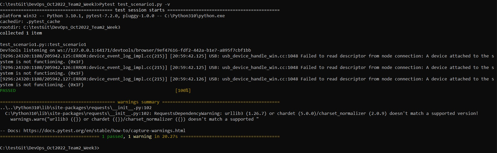
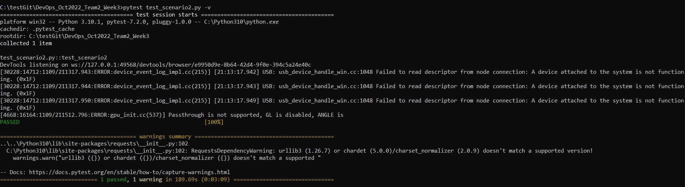

# DevOps_Oct2022_Team2_Week3

Test Scenario 1
- Search function for Selenium Books

Test Conditions:
- User must be at https://www.nlb.gov.sg/main/home
- Site is online at any given time

Test Values:
- "Selenium"

Test Description:
- When user reaches the homepage, a search for "Selenium"
is inputted into the search box, then the search button
is pressed. There should be results of "Selenium" books
shown

Expected Test Outcomes:
- User redirected to search result of "Selenium" books
available

Resultant Screenshot:

=================================================== 
Test Scenario 2
- What's On Tab;search function for Programming events

Test Conditions:
- User must be at https://www.nlb.gov.sg/main/home
- Site is online at any given time

Test Values:
- "Programming"

Test Description:
- When user reaches the homepage, the user then navigates
to "What's on", which is basically a webpage to search for
events involving NLB. A search for "Programming"
is inputted into the search box, then the search button
is pressed. There should be results of "Programming" events
shown.

Expected Test Outcomes:
- User redirected to search results of "Programming" events

Resultant Screenshot:

===================================================

Test Scenario 3
- About us page

Test Conditions:
- User must be at https://www.nlb.gov.sg/main/home
- Site is online at any given time

Test Values:
- 

Test Description:
- When user reaches the homepage, a click on the about us button will navigate the user to the about us page

Expected Test Outcomes:
- User redirected to about us page

Resultant Screenshot:

===================================================

Test Scenario 4
- Partner us page

Test Conditions:
- User must be at https://www.nlb.gov.sg/main/home
- Site is online at any given time

Test Values:
- 

Test Description:
- When user reaches the homepage, a click on the partner us button will navigate the user to the about us page

Expected Test Outcomes:
- User redirected to partner us page

Resultant Screenshot:

Test Scenario 5

Partner us page
Test Conditions:
- User must be at https://www.nlb.gov.sg/main/home
- Site is online at any given time

Test Values:

Test Description:
- When user reaches homepage, they click on the discover and learn button will navigate the user to the discover and learn page

Expected Test Outcomes:
- user redirected to discover and learn page

Resultant Screenshot:

